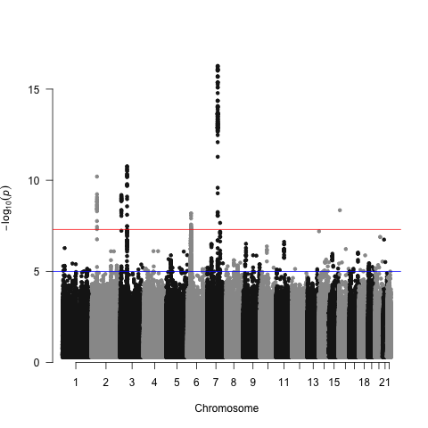
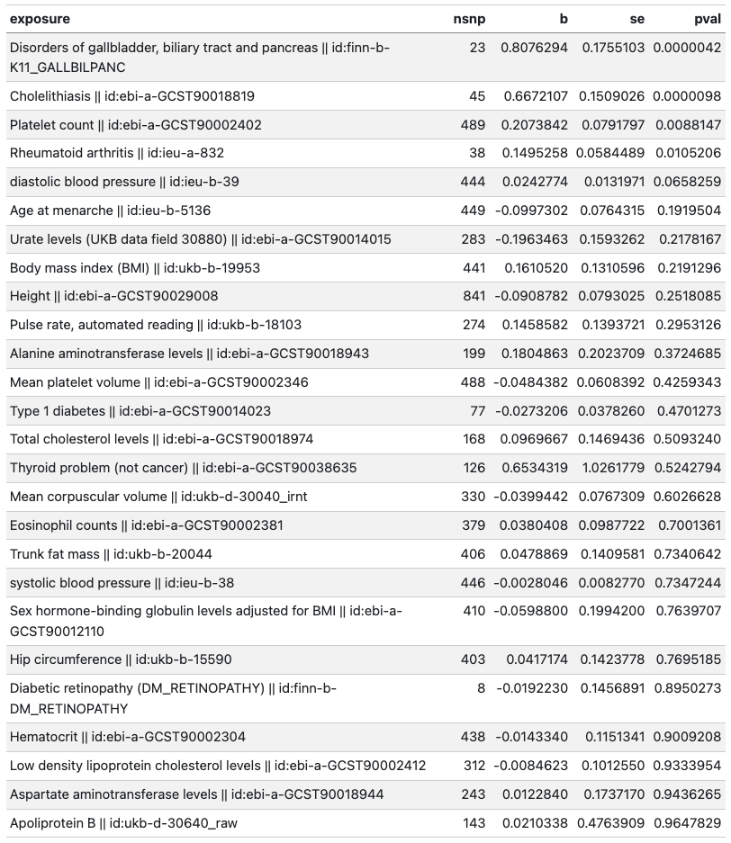

# PheWAS + MR analysis of gall bladder cancer GWAS

In this analysis we wish to try to interpret associations arising from PheWAS of the gall bladder cancer top hits.

This is the GWAS for gall bladder cancer:

Each of the tophits was scanned using OpenGWAS and led to a result that looked like `data/phewas/10_phewas_results_of_8_lead_snps_GBC.csv`. In OpenGWAS there are many redundant traits, and so to clean it up sometimes the easiest thing to do is simply make a simplified list of the traits to follow up manually: `data/gbc-traits-from-phewas.csv`. This is simply picking out the key traits that represent the full list, trying to preferentially choose the best powered GWAS for each trait.

Now the key question of this analysis is represented in this figure:

**Does a PheWAS result arise because the GBC variant passes through the PheWAS trait, or is pleiotropic with the trait?**

The `scripts/phewas-followup-g2.qmd` performs an analysis whereby

1. It obtains all genetic instruments for the candidate traits in `data/gbc-traits-from-phewas.csv`
2. Performs MR of each of those traits, excluding the original GWAS hit from GBC to avoid that leading to bias
3. Compares the MR result using the GBC hit vs the MR result from the independent instruments for the candidate trait

See the MR table in `scripts/phewas-followup-g2.html`

It suggests that gallbladder conditions, cholelithiasis, platelet count may be mediating the effect of the some of the GWAS hits, though examining `figures/phewas_followup_results-g2.pdf` shows that for many of the hits they are not fully mediated.

